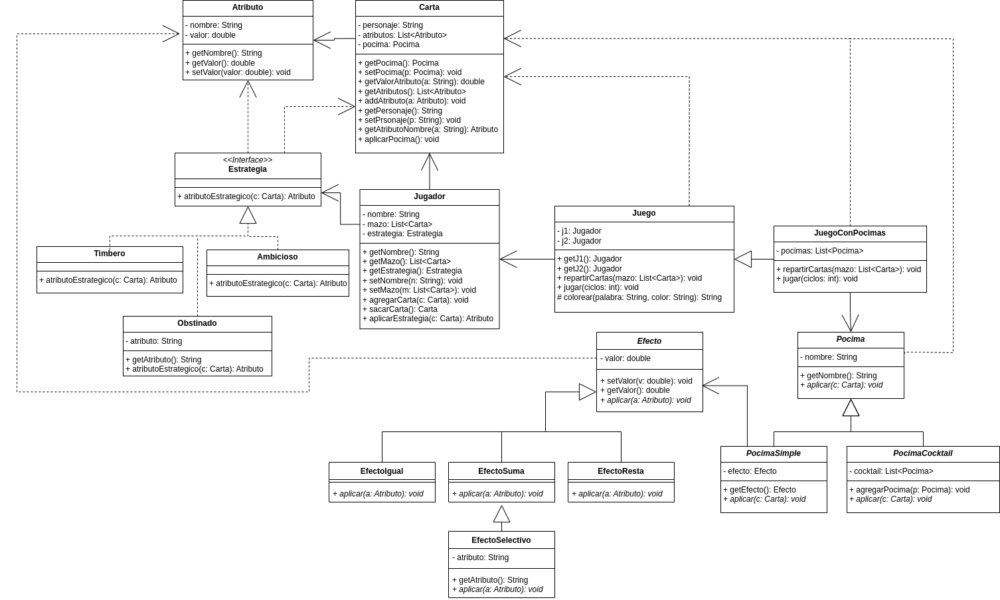

# Juego de Cartas
Un juego de cartas donde participan 2 jugadores, el que tenga mas cartas al final de cada ronda gana.  
El juego es por turnos, cada jugador saca una carta de su mazo, elije un atributo de su carta y el que tenga el mayor valor del atributo seleccionado de su carta se lleva ambas cartas, en caso de empate ambos recuperan su carta, el jugador que se queda sin cartas pierde.  
Se incorpora a la solucion un conjunto de Pocimas que pueden ser aplicadas a la carta y un conjunto de estrategias de juego.  

## Diagrama de la solucion

